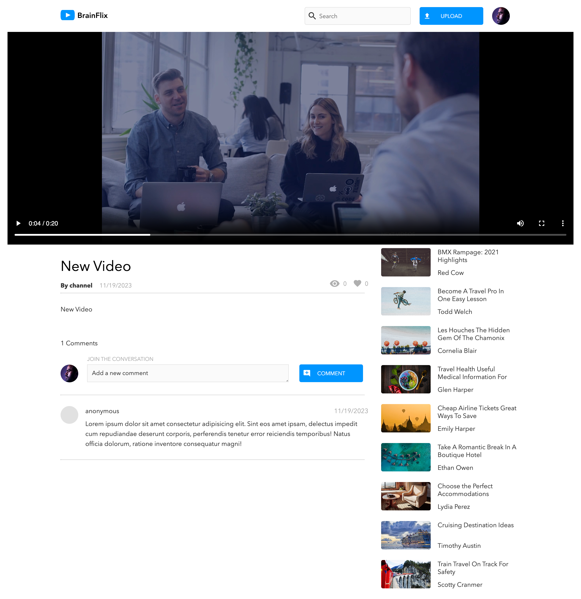

# BrainFlix

## Overview
This platform allows users to upload videos seamlessly. Whether you're showcasing your work, sharing memories, or collaborating with others, our platform makes video sharing easy and accessible.

## Project Screenshots

## Technologies Used
- **Frontend:** React, Sass
- **Backend:** Node.js, Express

## Installation
git clone git@github.com:manyprojects/brain-flix.git 
this project requires server api to run: 
git clone git@github.com:manyprojects/brain-flix-api.git 

### Change into the project directory
cd to the corresponding client and server directory 

### Install dependencies
npm install

### Start the development 
npm start

## Acknowledgments
- I want to express my gratitude to the BrainStation community for their support and inspiration. This project wouldn't be possible without the support of the community.

